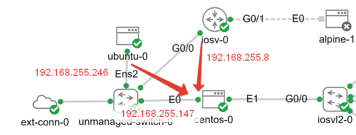

## Install strongswan on centos-0

```bash
yum install strongswan
vim /etc/strongswan/swanctl/swanctl.conf
```
```
connections {
  gw-gw {
    local_addrs = 192.168.255.147
    version = 1
    proposals = aes128-sha256-modp2048
    reauth_time = 1440m
  
    local {
     auth = psk
     id = 192.168.255.147
    }

    remote {
     auth = psk
     id = %any
    }

    children {
     gre {
      local_ts = dynamic[gre]
      remote_ts = dynamic[gre]
      mode = transport
      esp_proposals = aes256-sha256
      rekey_time = 60m
      start_action = trap
      dpd_action = restart
     }
    }
  }
}

secrets {
 ike {
    secret = "TheSecretMustBeAtLeast13bytes"
  }
}

# Include config snippets
include conf.d/*.conf
```

## Create GRE connections for iosv-0 and ubuntu-0

```bash
nmcli connection add \
    con-name cisco \
    ifname cisco \
    type ip-tunnel \
    ip-tunnel.mode gre \
    ip-tunnel.ttl 255 \
    ip-tunnel.parent eth0 \
    ip-tunnel.remote 192.168.255.8 \
    ipv4.method manual \
    ipv4.addresses '192.168.20.5/30' \
    ipv6.method ignore

nmcli connection add \
    con-name ubnt \
    ifname ubnt \
    type ip-tunnel \
    ip-tunnel.mode gre \
    ip-tunnel.ttl 255 \
    ip-tunnel.parent eth0 \
    ip-tunnel.remote 192.168.255.246 \
    ipv4.method manual \
    ipv4.addresses '192.168.20.5/30' \
    ipv6.method ignore
```

## IOSv-0 

```cisco
crypto isakmp policy 1
 encr aes 
 hash sha256
 authentication pre-share
 group 14 
!
crypto isakmp key TheSecretMustBeAtLeast13bytes address 192.168.255.147
crypto isakmp nat keepalive 5
!         
crypto ipsec transform-set TSET esp-aes 256 esp-sha256-hmac 
 mode transport
!         
crypto ipsec profile VTI
 set transform-set TSET 
!
interface Tunnel0
 ip address 192.168.20.1 255.255.255.252
 tunnel source GigabitEthernet 0/0
 tunnel destination 192.168.255.147
 tunnel protection ipsec profile VTI
 ip ospf mtu-ignore
 no shut
```

## Create GRE on ubuntu-0

```bash
vim /etc/netplan/network.yaml
```

```yaml
    tunnels:
        gre:
            mode: gre
            remote: 192.168.255.147
            local: 0.0.0.0
            addresses:
              - 192.168.20.6/30
            routes:
              - to: 10.10.30.0/24
                via: 192.168.20.5
```

## Install and configure Strongswan on ubuntu-0

```bash
apt install strongswan
vim /etc/ipsec.conf
```

```
conn mytunnel
    auto=start
    authby=secret
    keyexchange=ikev1
    ike=aes128-sha256-modp2048
    type=transport
    phase2=esp
    phase2alg=aes-sha2_256
    encapsulation=yes
    leftprotoport=gre
    rightprotoport=gre
    left=%any
    right=192.168.255.147
```

```bash
vim /etc/ipsec.secrets
```
```
%any %any : PSK "TheSecretMustBeAtLeast13bytes"
```

```bash
systemctl restart strongswan-starter.service
```