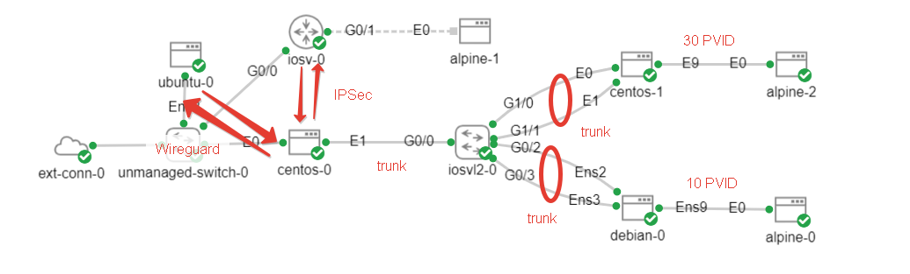

### STEP 1 ) Configure the cisco router

```
!
hostname router
line console 0
 exec-timeout 0 0
 logging synchronous 
!
interface gigabitEthernet 0/0
 ip address dhcp 
  ip nat outside
  no shut
!
interface gigabitEthernet 0/1
 ip address 10.10.90.1 255.255.255.0
 ip nat inside
 no shut
!
access-list 1 permit 10.10.90.0 0.0.0.255
ip nat inside source list 1 interface Gi0/0 overload
!
ip dhcp pool dead_10.10.90.0
 network 10.10.90.0 /24
 dns-server 8.8.8.8 8.8.4.4
 default-router 10.10.90.1
 lease 1
!
crypto isakmp policy 1
 encr aes
 authentication pre-share
 hash sha256
 group 14
!
crypto isakmp key TheSecretMustBeAtLeast13bytes address 192.168.255.147
crypto isakmp nat keepalive 5
!
crypto ipsec transform-set TSET  esp-aes 256 esp-sha256-hmac
mode tunnel
!
crypto ipsec profile VTI
set transform-set TSET
!
interface Tunnel0
 ip address 192.168.20.1 255.255.255.252
 tunnel source GigabitEthernet 0/0
 tunnel destination 192.168.255.45
 tunnel mode ipsec ipv4
 tunnel protection ipsec profile VTI
 no shut
!
```

SHOW the results
```
sh crypto isakmp sa
```

### Step 2 ) Configure linux

```bash
dnf install libreswan
```

```
config setup
        listen=<linux-ip>

conn mytunnel
    auto=start
    authby=secret
    type=tunnel
    ike=aes128-sha2;dh14
    ikev2=no
    phase2=esp
    phase2alg=aes-sha2_256
    pfs=no
    encapsulation=yes

    leftsubnet=0.0.0.0/0
    rightsubnets=10.10.90.0/24,192.168.20.0/30
    left=<linux-ip>
    right=<cisco-ip>

    mark=5/0xffffffff
    vti-interface=vti01
    vti-routing=yes
    vti-shared=yes
    leftvti=192.168.20.2/30
```

/etc/ipsec.d/cisco.secrets

```
%any %any : PSK "TheSecretMustBeAtLeast13bytes"
```

### STEP 3 ) Check the result

```bash
ip -br a
ip xfrm state
ip xfrm policy
```

## With Dynamic Routing

### Chnage cisco tunnel settings and add ospf
```
interface Tunnel0
 ip address 192.168.20.1 255.255.255.252
 ip ospf network broadcast
 ip ospf mtu-ignore
 tunnel source GigabitEthernet0/0
 tunnel mode ipsec ipv4
 tunnel destination <linux-ip>
 tunnel protection ipsec profile VTI

router ospf 1
 network 10.10.90.0 0.0.0.255 area 0
 network 192.168.20.0 0.0.0.3 area 0
```

### Chnage linux ipsec settings

```bash
vim /etc/ipsec.conf
```
```
    leftsubnet=0.0.0.0/0
    rightsubnet=0.0.0.0/0
    left=<linux-ip>
    right=<cisco-ip>
```

### Install FRR

```bash
dnf install frr
```

Enbale ospf
```bash
vim /etc/frr/daemons
ospfd=yes
```

### Start FRR

```
systemctl enable --now frr
vtysh
```

### Configure OSPF
```
interface vti01
 ip ospf mtu-ignore

router ospf
 network 10.10.10.0/24 area 0
 network 10.10.20.0/24 area 0
 network 10.10.30.0/24 area 0
 network 10.10.50.0/24 area 0
 network 192.168.20.0/30 area 0
```