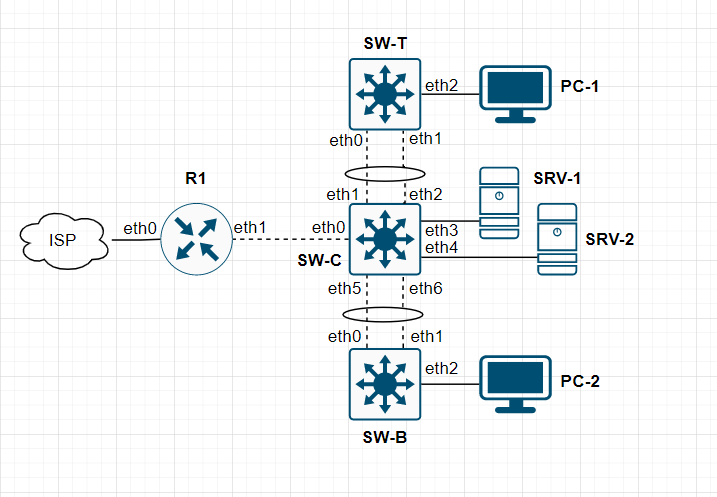

## Astra - openvswitch

## Enable Debian repos

```bash
vim /etc/apt/sources.list
deb http://dl.astralinux.ru/astra/stable/1.7_x86-64/repository-main/ 1.7_x86-64 main contrib non-free

sudo apt update
sudo apt install -y apt-transport-https ca-certificates wget

wget https://dl.astralinux.ru/astra/testing/orel/repository/pool/main/d/debian-archive-keyring/debian-archive-keyring_2017.5_all.deb
sudo apt install ./debian-archive-keyring_2017.5_all.deb

vim /etc/apt/sources.list
```

```
deb http://dl.astralinux.ru/astra/stable/1.7_x86-64/repository-main/ 1.7_x86-64 main contrib non-free
deb http://deb.debian.org/debian/               stretch         main contrib non-free
deb http://security.debian.org/debian-security/ stretch/updates main contrib non-free
deb http://mirror.yandex.ru/debian/             buster          main contrib non-free
```

```bash
apt update
apt-key adv --recv-keys --keyserver keyserver.ubuntu.com DCC9EFBF77E11517
apt update
```

### Install OVS

```bash
apt update
apt install openvswitch-switch
```

#### Unmanaged in NM

```bash
nmcli device set eth1 managed no
```

### Configure OVS

```bash
vim /etc/netwrok/interfaces
```

```
auto ovs0
allow-ovs ovs0
iface ovs0 inet manual
  ovs_type OVSBridge
  ovs_ports eth1 ovs0-10

allow-ovs0 eth1
iface eth1 inet manual
  ovs_type OVSPort
  ovs_bridge ovs0
  ovs_options vlan_mode=native-untagged tag=1 trunks=10,20,30

allow-ovs0 ovs0-10
iface ovs0-10 inet static
  ovs_bridge ovs0
  ovs_type OVSIntPort
  ovs_options tag=10
  address 192.168.40.1/24
```

### Trun on ovs

```bash
ifup ovs0
```

# Test stand



### R1

```
auto eth0
iface eth0 inet dhcp

auto ovs0
allow-ovs ovs0
iface ovs0 inet manual
  ovs_type OVSBridge
  ovs_ports eth1 ovs0-10 ovs0-20 ovs0-30

allow-ovs0 eth1
iface eth1 inet manual
  ovs_type OVSPort
  ovs_bridge ovs0
  ovs_options vlan_mode=native-untagged tag=1 trunks=10,20,30

allow-ovs0 ovs0-10
iface ovs0-10 inet static
  ovs_bridge ovs0
  ovs_type OVSIntPort
  ovs_options tag=10
  address 192.168.10.1/24

allow-ovs0 ovs0-20
iface ovs0-20 inet static
  ovs_bridge ovs0
  ovs_type OVSIntPort
  ovs_options tag=20
  address 192.168.20.1/24

allow-ovs0 ovs0-30
iface ovs0-30 inet static
  ovs_bridge ovs0
  ovs_type OVSIntPort
  ovs_options tag=30
  address 192.168.30.1/24
```

### SW-C

```
auto ovs0
allow-ovs ovs0
iface ovs0 inet manual
  ovs_type OVSBridge
  ovs_ports eth1 eth2 eth3 eth4 eth5 eth6 bond0 bond1

allow-ovs0 eth0
iface eth0 inet manual
  ovs_type OVSPort
  ovs_bridge ovs0
  ovs_options vlan_mode=native-untagged tag=1 trunks=10,20,30

allow-ovs0 eth3
iface eth3 inet manual
  ovs_type OVSPort
  ovs_bridge ovs0
  ovs_options tag=30

allow-ovs0 eth4
iface eth4 inet manual
  ovs_type OVSPort
  ovs_bridge ovs0
  ovs_options tag=30

allow-ovs0 bond0
iface bond0 inet manual
    ovs_bridge ovs0
    ovs_type OVSBond
    ovs_bonds eth1 eth2
    ovs_options bond_mode=active-backup lacp=active vlan_mode=native-untagged tag=1 trunks=10,20

allow-ovs0 bond1
iface bond1 inet manual
    ovs_bridge ovs0
    ovs_type OVSBond
    ovs_bonds eth5 eth6
    ovs_options bond_mode=active-backup lacp=active vlan_mode=native-untagged tag=1 trunks=10,20
```

### SW-T

```
auto ovs0
allow-ovs ovs0
iface ovs0 inet manual
  ovs_type OVSBridge
  ovs_ports eth0 eth1 eth2 bond0

allow-ovs0 eth2
iface eth2 inet manual
  ovs_type OVSPort
  ovs_bridge ovs0
  ovs_options tag=10

allow-ovs0 bond0
iface bond0 inet manual
    ovs_bridge ovs0
    ovs_type OVSBond
    ovs_bonds eth0 eth1
    ovs_options bond_mode=active-backup lacp=active vlan_mode=native-untagged tag=1 trunks=10,20
```

### SW-B

```
auto ovs0
allow-ovs ovs0
iface ovs0 inet manual
  ovs_type OVSBridge
  ovs_ports eth0 eth1 eth2 bond0

allow-ovs0 eth2
iface eth2 inet manual
  ovs_type OVSPort
  ovs_bridge ovs0
  ovs_options tag=20

allow-ovs0 bond0
iface bond0 inet manual
    ovs_bridge ovs0
    ovs_type OVSBond
    ovs_bonds eth0 eth1
    ovs_options bond_mode=active-backup lacp=active vlan_mode=native-untagged tag=1 trunks=10,20
```

## SRV-1 DHCP

```
authoritative;
option domain-name 		"ht2022.wsr";
option domain-name-servers	192.168.30.2, 192.168.30.3;
option domain-search		"ht2022.wsr";
default-lease-time		604800;
max-lease-time			2419200;

failover peer "dhcp-failover" {
	primary;
	address 192.168.30.2;
	port 519;
	peer address 192.168.30.3;
	peer port 520;
	max-response-delay 30;
	max-unacked-updates 10;
	load balance max seconds 3;
	mclt 1800;
	split 128;
	auto-partner-down 86400;
}

subnet 192.168.30.0 netmask 255.255.255.0 {}

subnet 192.168.10.0 netmask 255.255.255.0 {
	option routers 192.168.10.1;
	pool {
		failover peer "dhcp-failover";
		range 192.168.10.10 192.168.10.50;
		#allow members of "VLAN10";
	}
}

subnet 192.168.20.0 netmask 255.255.255.0 {
	option routers 192.168.20.1;
	pool {
		failover peer "dhcp-failover";
		range 192.168.20.10 192.168.20.50;
		#allow members of "VLAN20";
	}
}
```

## SRV-2 DHCP

```
authoritative;
option domain-name 		"ht2022.wsr";
option domain-name-servers	192.168.30.2, 192.168.30.3;
option domain-search		"ht2022.wsr";
default-lease-time		604800;
max-lease-time			2419200;

failover peer "dhcp-failover" {
	secondary;
	address 192.168.30.3;
	port 520;
	peer address 192.168.30.2;
	peer port 519;
	max-response-delay 30;
	max-unacked-updates 10;
	load balance max seconds 3;
	auto-partner-down 86400;
}

subnet 192.168.30.0 netmask 255.255.255.0 {}

subnet 192.168.10.0 netmask 255.255.255.0 {
	option routers 192.168.10.1;
	pool {
		failover peer "dhcp-failover";
		range 192.168.10.10 192.168.10.50;
		#allow members of "VLAN10";
	}
}

subnet 192.168.20.0 netmask 255.255.255.0 {
	option routers 192.168.20.1;
	pool {
		failover peer "dhcp-failover";
		range 192.168.20.10 192.168.20.50;
		#allow members of "VLAN20";
	}
}
```

## R1 Relay

```bash
apt install isc-dhcp-relay
```

