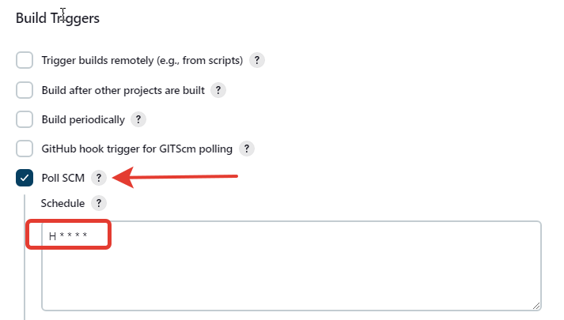
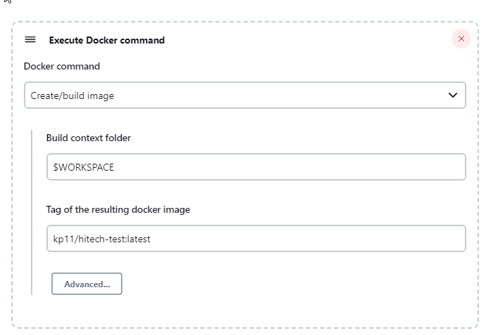

## Install Docker

```bash
apt-get update
apt-get install ca-certificates curl gnupg lsb-release

mkdir -p /etc/apt/keyrings
curl -fsSL https://download.docker.com/linux/ubuntu/gpg | gpg --dearmor -o /etc/apt/keyrings/docker.gpg

echo "deb [arch=$(dpkg --print-architecture) signed-by=/etc/apt/keyrings/docker.gpg] https://download.docker.com/linux/ubuntu \
  $(lsb_release -cs) stable" | tee /etc/apt/sources.list.d/docker.list > /dev/null

apt-get update
apt-get install docker-ce docker-ce-cli containerd.io docker-compose-plugin
```

## Edit config

```bash
vim /etc/docker/daemon.json
```
```json
{
          "log-driver": "json-file",
          "log-opts": {
                  "max-size": "10m",
                  "max-file": "3"
          },
          "default-address-pools": [
                  {
                          "base": "192.168.0.0/16",
                          "size": 24
                  }
          ]
}
```

```bash
systemctl restart docker.service
```

## MAC

```bash
dhcp-host=00:16:3e:09:c7:18,container1,10.10.10.84
```

## SRV2 install jenkins


```bash
apt install openjdk-11-jre
```

Follow this guide: [Install Jenkins](https://www.jenkins.io/doc/book/installing/linux/)

## FW1 install nginx

```nginx
    server {
        listen       80;
        server_name  jenkins.ht2022.wsr;

        location / {
                proxy_pass http://SRV2-IP:8080;

                # Required for Jenkins websocket agents
                proxy_http_version 1.1;
                proxy_set_header Upgrade $http_upgrade;
                proxy_set_header Connection "upgrade";

                proxy_set_header   Host              $host;
                proxy_set_header   X-Real-IP         $remote_addr;
                proxy_set_header   X-Forwarded-For   $proxy_add_x_forwarded_for;
                proxy_set_header   X-Forwarded-Proto $scheme;

        }
    }
```

## Configure Jenkins

```bash
gpasswd -a jenkins docker
systemctl restart jenkins.service
```

- Manage Jenkins > Configure System > Docker Builder > Docker URL
  - unix:///var/run/docker.sock
- Repository URL: https://github.com/2c9/devops-hi-tech-2022.git
- Branch: */main
- Poll SCM: H * * * *
- Build: $WORKSPACE
  - TAG: <user>/<image>:latest
- PUSH: <user>/<image>
  - TAG: latest
  - Registry: index.docker.io
  - Docker registry URL: https://index.docker.io/v1/








## Add SRV1 to nginx

```nginx
    server {
        listen       80;
        server_name  dev.ht2022.wsr;
        location / {
                proxy_pass http://SRV1-IP:5001;
        }
    }

    server {
        listen       80;
        server_name  ht2022.wsr;
        location / {
                proxy_pass http://SRV1-IP:5000;
        }
    }
```

## SRV1 create containers

```bash
docker network create local

docker run --name prod -d \
           -p 5000:5000 \
           --network local \
           kp11/hitech:latest

docker run --name dev -d \
           -p 5001:5000 \
           --network local \
           kp11/hitech-test:latest

# https://github.com/containrrr/watchtower

docker run --detach \
    --name watchtower \
    --volume /var/run/docker.sock:/var/run/docker.sock \
    containrrr/watchtower --interval 30
```

## Test CI/CD